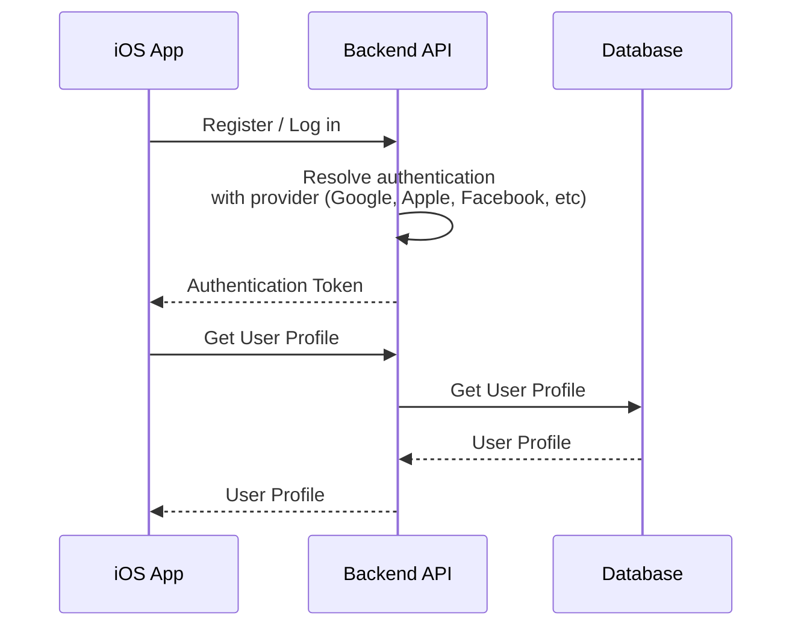
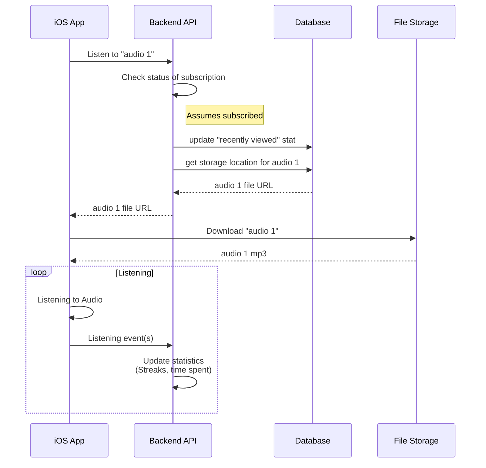
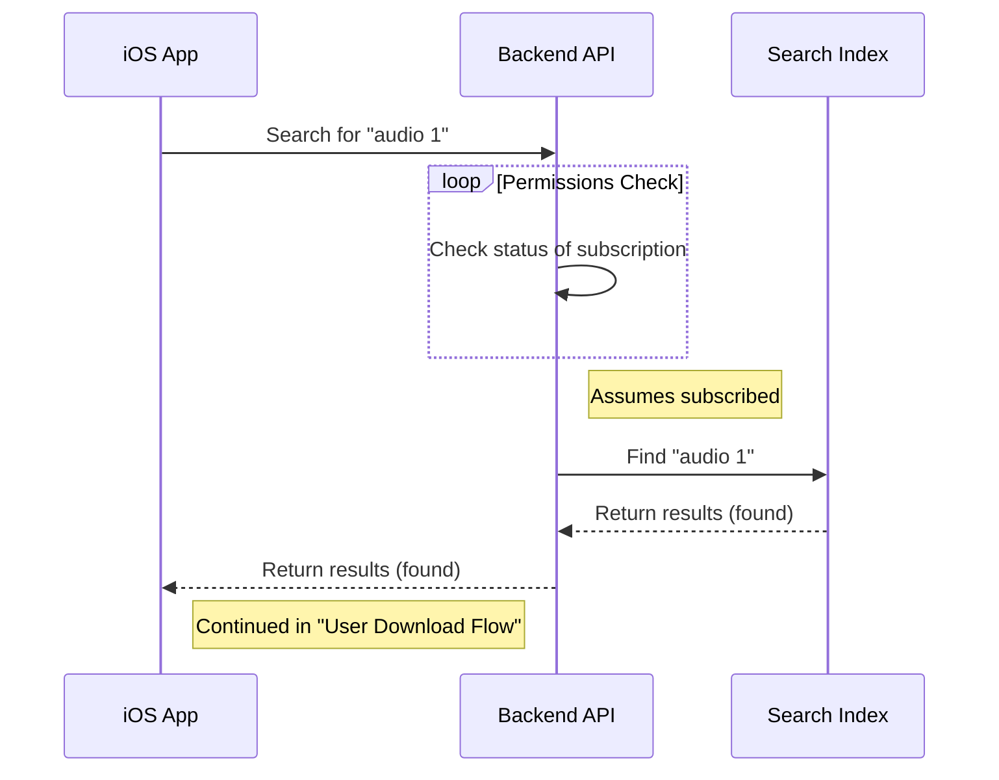
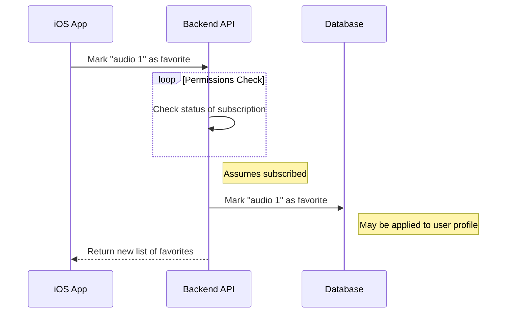
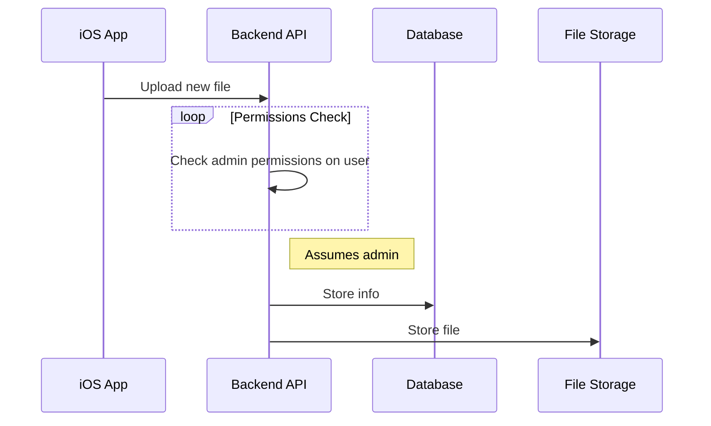
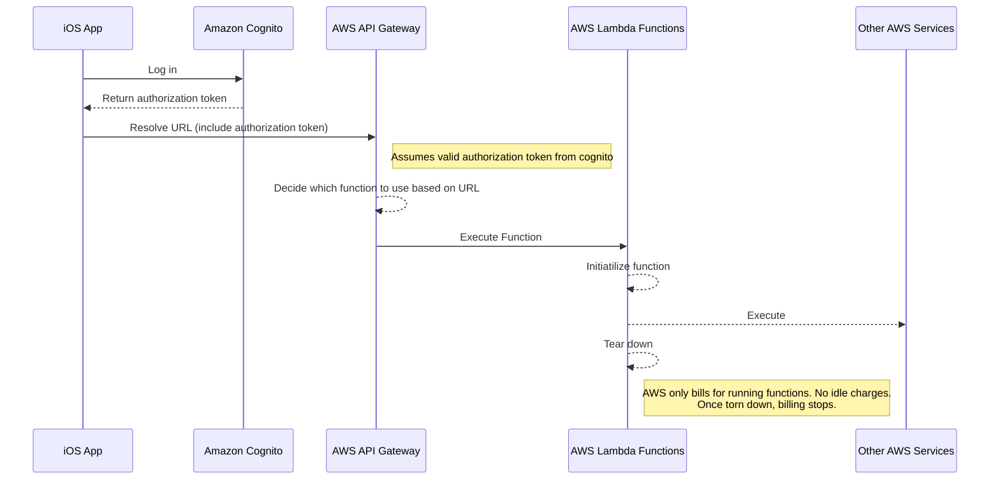

# gfulness Proposal

## High Level Requirements

### User Log In/Registration

### User Download Flow (assumes logged in)

### User Search Flow (assumes logged in)

### Mark as favorite (assumes logged in)

### Admin Upload Flow

## Detailed Requirements

### iOS App
---
* Native SwiftUI Implementation
    * Quicker iteration
    * Future proof
    * iOS 13+
* Offline storage
    * Simple internal database
    * Save files as they are downloaded
        * Only stream once. Saves bandwidth cost.

### Backend API
----

#### Composition

Backend API is composed of `AWS API Gateway`, `Amazon Cognito`, and `AWS Lambda Functions`

#### Amazon Cognito [(link)](https://aws.amazon.com/cognito/)
* AWS managed user pool and permission management
* Handles federated log in automatically (log in with Google, Apple, Facebook, etc)
* Standards based
* Easy app integration through AWS Amplify iOS Framework
* Reasonable pricing tiers 
    * Users who sign in directly with their User Pool credentials or with social identity providers: 
    * First 50,000 monthly active users are free
    * 50,001-100,000 (after the 50,000 free tier) $0.0055 per Monthly Active User ($550/mo for 100,000 users)
    * Next 900,000 $0.0046 per Monthly Active User

#### AWS API Gateway [(link)](https://aws.amazon.com/api-gateway/)
* Accepts URL requests from iOS App and routes to proper functions in AWS
* Creates an abstraction between technology user to service URLs and technology used to resolve them
    * Can easily move from function to other service in AWS
* Pricing tiers
    * First 333 million requests - $3.50 per million ($1650/mo for 333 million requests that month)

#### AWS Lambda Functions
* "Serverless" functions in AWS that only live through their execution.
    * Traditionally, a server is always on and needs to live on a computer (either virtual or on premises)
    * Traditional servers run regardless of usage
    * Serverless functions abstract away the live computer and only charge for the time functions are running
    * When nothing is running (no one is using the app), charges are not incurred like in a traditional server environment
* Supports various programming languages. Can be swapped between Javascript, C#, Swift, etc. Easy to familiarize in developers.
* Reasonable pricing
    * $0.20 per 1 million requests
    * $0.0000166667 for every GB-second (memory based)
    * Some digestible scenarios for example (from site)
        * If you allocated 512MB of memory to your function, executed it 3 million times in one month, and it ran for 1 second each time. $18.74 per month
* Each API call (an iOS app making a request for some data) typically results in 1 function running for less than one second.

### Database / Data Store (The Data Layer)
--- 
#### Composition

Data Layer is composed of `DynamoDB`, `Elasticsearch`, and `Amazon Simple Storage Solutions (S3)`

#### AWS DynamoDB [(link)](https://aws.amazon.com/dynamodb/)
* NoSQL document based data storage
* Incredibly fast and lightweight. Does not use MySQL. This solution does not require much relational computation, as most of it is single "documents" representing a piece of content (title, description, storage url, genre), and some key-value information about a user's habits (favorites, statistics). NoSQL is all memory based and allows for tremendous speed gains at the cost of computational power (dumber and based more on storage format than functions)
* Pricing: 
    * Write request units (writing to database): $1.25 per million write request units
    * Read request units (reading from database): $1.25 per million write request units
* Majority of traffic will be read based traffic (with some writes for favorites and listening time)

#### Elasticsearch [(link)](https://aws.amazon.com/elasticsearch-service/)
* High performance search index
* Allows for text search, fuzzy search, typeahead
* Optimized for searching and analytics
* Always-on server model
* Pricing based on server size [Pricing](https://aws.amazon.com/elasticsearch-service/pricing/?nc=sn&loc=3)
    * Recommended t2.medium to start

#### Amazon Simple Storage Solutions (S3)[(link)](https://aws.amazon.com/s3/pricing/?trk=ps_a134p000006BgajAAC&trkCampaign=acq_paid_search_brand&sc_channel=ps&sc_campaign=acquisition_US&sc_publisher=google&sc_category=storage&sc_country=US&sc_geo=NAMER&sc_outcome=acq&sc_detail=amazon%20s3%20pricing&sc_content=S3_e&sc_segment=423676352622&sc_medium=ACQ-P%7CPS-GO%7CBrand%7CDesktop%7CSU%7CStorage%7CProduct%7CUS%7CEN%7CSitelink&s_kwcid=AL!4422!3!423676352622!e!!g!!amazon%20s3%20pricing&ef_id=Cj0KCQjwhvf6BRCkARIsAGl1GGhzEYHsJcS03j5Xuw0-Sxwv8Hp0mlD97rslg0x3MDOg5a4nMTRLkWQaAqLeEALw_wcB:G:s&s_kwcid=AL!4422!3!423676352622!e!!g!!amazon%20s3%20pricing) + Cloudfront CDN [(link)](https://aws.amazon.com/cloudfront/pricing/)
* Bucket-based cloud file storage for mp3 files
* Inexpensive storage
* Industry standard solution
* Fast transfer (Cloudfront storage at "edge locations")
* Pricing:
    * First 50TB $0.023 per GB - $1150/mo for 50,000 GB (500,000 100mb mp3 files).

### Infrastructure
---
#### Cloudwatch Logs
* Logging for all services (seeing what's going on so issues can be resolved and diagnosed)
* Alarms for issues in production (if something goes down or is acting strange, we will know about without customers reporting it)

# Cost Analysis
* Included below are three cost scenarios priced in Amazon's cost calculator tool. 
* The primary cost factor for this solution is data transfer incurred from audio files.
* The scenarios below assume:
    * 100mb per audio mp3
    * Elasticsearch used (constant node cost. traditional server)
    * Includes Cloudwatch alarms for monitoring service health so that engineers can fix issues in production
    * Does not include all internal infrastructure costs (code storage, deployments). Usually fairly negligable for a small team of developers. (+$10/mo)
    * Some additional cost for the domain name may be incurred. [(link)](https://aws.amazon.com/route53/pricing/)

[Scenario 1 - 0 users - base scale](https://calculator.aws/#/estimate?id=b4314c3049818dab69f230c2823637eb88549f6f) $50.48/month 

[Scenario 2 - 100 users downloading one audio every day](https://calculator.aws/#/estimate?id=e42d03f3139ba76f109c47ed796a167baff90dd3) $120/month

[Scenario 3 - 10,000 users downloading one audio every day](https://calculator.aws/#/estimate?id=b1ee3a6a87465624c7412bd4b48eb9d08fcb3f91) $994.55/month

### Pricing levers
Due to the speed of DynamoDB, we can allow users to always get the entire library of content to their device periodically instead of on a context basis (per genre or per page). This way, search can be performed on the device and we would not need to use Elasticsearch (constant cost).

### Development Estimates

Both AWS and iOS efforts are estimated at roughly the same time and effort

#### Milestone 1 - AWS
* 10 hours a week. 4 weeks. $100/hour - $4000

#### Milestone 2 - iOS App
* 10 hours a week. 4 weeks. $100/hour - $4000
